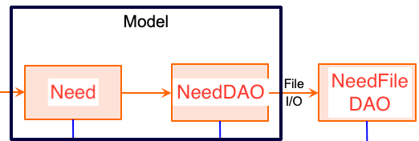

# PROJECT Design Documentation

## Team Information
* Team name: 2b or not 2b
* Team members
  * Aidan Cusack
  * John Bennett
  * Jackson Carey
  * Jason Barnes

## Executive Summary

The "UFund" project by Team 2b or Not 2b provides its users with a simple approach for interacting with fundable items, while simultaneously providing easy backend support for managing accounts and other resources. At its core, the project seeks to find a way to streamline the otherwise cumbersome process of selecting items by utilizing a Single Page Application model. Users can seamlessly navigate the site, browse for needs, and add them to their cart, and admins can efficiently ensure that the site data remains up-to-date. In order to maintain project momentum and negate issues with scalability, the team is employing the Agile methodology.

### Purpose
The project is aimed to cater to users funding the store, making it a simple streamlined process. The goal is for users to be able to pick which items they would like to fund from the inventory and for admins to be able to modify the inventory for the current needs of the store.

### Glossary and Acronyms

| Term | Definition |
|------|------------|
| SPA | Single Page |

## Requirements

This section describes the features of the application.

### Definition of MVP
The minimal viable product consists of functionality allowing a user to log in and be able to add or remove needs from the inventory to their carts and search needs in the inventory. Additionally, an admin should be able to log in and add, remove, or edit need data in the inventory.

### MVP Features

Get a single need
Create a new need
Delete a single need
Get entire cupboard
Update a need
Search for needs
Data persistence - cart
Add/remove needs from cart
Log in helper
Log in admin
Browse needs
Data persistence - inventory
Proceed to checkout

### Enhancements

We implemented a dark mode. Everyone loves dark mode and it is much easier on the eyes. Users can toggle between dark mode and normal.

We also implemented a need recommendation system. The recommendation system shows above the need search and allows helpers to see a top list of needs and add them directly to their cart from there. The listed needs are weighted based on the needs the user has added to their cart already to offer a useful recommendation.

## Application Domain

This section describes the application domain.

The main features of the domain for this application include the UFund Manager, Helper, Needs, Inventory, Cart, and Checkout. A UFund manager should be able to interact with the needs and inventory by editing need data within the inventory to adjust for the UFund's current needs. The Helper should be able to interact with the needs, inventory, cart, and checkout by adding/removing needs from the inventory to their cart and then proceeding to checkout. 

## Architecture and Design

This section describes the application architecture.

### Summary

The following Tiers/Layers model shows a high-level view of the webapp's architecture. 
**NOTE**: detailed diagrams are required in later sections of this document.

The web application, is built using the Model–View–ViewModel (MVVM) architecture pattern. 

The Model stores the application data objects including any functionality to provide persistance. 

The View is the client-side SPA built with Angular utilizing HTML, CSS and TypeScript. The ViewModel provides RESTful APIs to the client (View) as well as any logic required to manipulate the data objects from the Model.

Both the ViewModel and Model are built using Java and Spring Framework. Details of the components within these tiers are supplied below.

### Overview of User Interface

This section describes the web interface flow; this is how the user views and interacts with the web application.

If the user logs in as a helper they are presented with a screen which includes recommended needs at the top, as well as the ability to search for additional needs. They are then able to add or remove any need to their funding basket. If the user logs in as an admin, they are similarly presented with recommended needs and the ability to search for more, but instead of being able to add and remove them from a funding basket they are able to edit the data of each need in the inventory.

### View Tier

 

 The view tier consists of our ufund-ui directory containing all of our UI frontend which faces the users. In this tier we start with the login. This is where users view the login screen, obviously. After logging in, the user is directed to the dashboard. The view is different depending on what you login as, helper or admin. On the dashboard, components such as checkout, dark-mode, need-search, and needs can be used to show what those views show as described by their names. The need-detail component comes up when admins click on a need and need to edit needs. Helpers and admins are restricted by where they are allowed to go as described by the MVP. Admins cannot access the cart but helpers can. When adding to cart the cart is filled with the need in the dashboard and when proceeding to checkout a popup appears with the cart and the ability to complete checkout. Then you are returned to dashboard after checking out. 
 
 An example sequence to describe the above is this:
 As an admin: login (login component)->search or click on recommended need (dashboard)->edit need (need-detail)
 As a helper: login (login)->search or click on recommended need (dashboard)->rejection popup and remain on page
 The admin is allowed to edit the need and the helper is rejected.
 Another goes:
 As a helper: login (login)->add needs to cart(dashboard)->proceed to checkout(checkout)->return to dashboard
 As an admin: login (login)->cannot add to cart because the option isn't available for admins.
### ViewModel Tier

1. NeedController -- Creates a REST API controller to reponds to requests
2. NeedDAO -- Defines the interface for Need object persistence. Used by the NeedController to perform CRUD operations.

The ViewModel bridges the gap between the view and the model. So when the user requests something in the view the model needs to handle the requested task. The NeedController is where these requests are sent initially. Then the controller can distribute tasks as needed. There is also the services available in the ufund-ui directory. We have services for checkout, and needs. The checkout service watches the user to trigger the checkout panel. The need service creates the requests to the need controller so that the controller can do what it needs to in the model as described above. 

An example sequence to describe the above is:
Logged in as helper: add items to cart -> click proceed to checkout (checkout service opens checkout panel) -> complete checkout (need service sends request to remove needs from database)
Another is:
Logged in as admin: click on need -> edit need (need service sends request to edit need as described)

### Model Tier

1. Need -- Represents a Need entity for when Needs are created.

The model contains everything in the backend. This consists of our Need class which holds everything that makes up a need, quantity, id, cost, etc. The NeedController is what distributes tasks among the backend, mostly to NeedFileDAO through needDAO interface. NeedFileDAO receives these tasks and pulls the required information or accomplishes a task and returns it as requested. 

An eaxmple sequence to describe the above is:
NeedController receives request searchNeeds->sends request to needDAO findNeeds->needFileDAO which implements needDAO runs findNeeds and returns result for NeedController.
NeedController receives request createNeed->sends request to needDAO getNeed with need getID->needFileDAO which implements needDAO runs and returns result->NeedController checks if NULL and stops if not and continues if so->sends request to needDAO to createNeed->needFileDAO runs task

## OO Design Principles

Single responsibility: Class should only have one reason to change.
Open/Closed: Classes should be open for extension but closed for modification.
Dependency inversion/injection: High level classes shouldn't depend on low level classes. Both should depend on abstract classes.
Controller: Delegates work to be done to other objects. 
Information expert: Responsibility placed on the class with the most information required to fulfill it.
Low coupling: Classes should have minimal dependency on each other.
Pure Fabrication: Class that does not represent a concept in the problem domain.
Law of Demeter: Class should have minimal knowledge about other classes and only interact with those closely related. 

Controller: We use a controller on the backend (NeedController.java) to handle receiving API requests and delegating the task elsewhere. 
Low coupling: Our classes do not depend on each other much, only handling their own responsibilities. An example is Need.java as it only represents a Need an nothing else. 
Law of Demeter: Classes are mostly private to themselves and only interact with those working on a similar responsibility. 
Information expert: Responsibilites are placed on the class with the most information to fulfill it for most of our design. For example, similar to the controller principle, our NeedController has the most information about Needs and how it can be used and is the best candidate for fulfilling the request based on what the user wants to do. 
Dependency: High level classes don't depend on low level classes in our design. However, we do have high level classes that depend on abstract classes correctly. For example, NeedFileDAO depends on NeedDAO which isn't technically an abstract class and rather an interface, but it is a collection of abstract methods that are imeplemented by NeedFileDAO.

These principles apply to the front end and backend. When a user attempts to accomplish something on the frontend, the request is sent to the controller, which is an OOP principle. The controller handles the request and delegates the task to the best fit to handle the task (or the information expert for that task, also an OOP principle). In the end we have a properly OOP designed program which incorporates all of the principles and allows easy modification as each class does not depend on eachother much and handles their own tasks (low coupling) as needed.

## Static Code Analysis/Future Design Improvements

For maintainability, we already have an A rating but a few pieces for easy improvement. Nothing that will take too long, most of it is things such as splitting long loops/functions and combining conditional blocks. Some of these will be touched on after the coverage analysis. 

Here we see that we have 74.6% coverage and 75% condition coverage. This misses the mark that we were looking for so we'll have to fill in what we missed as shown below.

The first image above shows our uncovered conditions locations. 7 are missing from NeedFileDAO and 3 from NeedController. The next shows our uncovered lines which includes the previous two files and additionally NeedsAPIApplication. That is simply a launcher and not necessary to cover so we can ignore that. To cover the rest we'll have to go through each of those uncovered locations in the original 2 files listed and ensure complete coverage. 

This issue suggests to reduce the complexity of the function to make it easier to understand and use. It can be easily split up into separate functions to make all of the parts easier to work with and understand. Separating the function will make identifying future issues much simpler. 

This issue suggests to extract the nested try block from the for loop into a separate method. Like the previous issue, it severely limits readability and understanding. Splitting it into a separate method will make issues much easier in the future with enhanced readability and ease of debugging. 

This issue suggests that the two branches having the same code is an issue. It is technically not a real issue and you could argue it is better to keep them separate for ease of making changes to each branch if necessary, but combining them into one branch would reduce lines and look cleaner. We'd have to add what the expectation for these situations are to our formatting guide. 

If there were more time we would have setup accounts to have access to what they checked out and continue to work with it somehow besides just checking out. So then each user could go to their profile and see their checked out needs and then perhaps continue to receive updated information on them, etc. We actually almost implemented this but ran out of time to fully implement it. 

Another potential future improvement is improved login security. Obviously just a username is not secure. This would go along with the extra account persistence well to allow users to have a secure environment to continue working with the needs they "purchased".

## Testing

### Acceptance Testing

Sprint 2: 5 user stories passed all their acceptance criteria tests and none are failing. 

Sprint 4: Another 5 user stories were finished being implemented and passed all their acceptance criteria tests and none are failing.

### Unit Testing and Code Coverage

For our strategy, we just made sure to include all cases we could think of for each constructor and function. We made objects with incomplete parameters and tried functions with incorrect parameters to make sure they resulted in the correct output and HTTP status code. We also tried correct inputs and made sure they behaved as intended with the correct HTTP code. For our code coverage, we had 3 tests run in our Model and Controller tiers with 0 errors, skips, or failures. Lastly for our Persistence tier we had 11 tests run with 0 errors, skips, and failures. We had high coverage targets as for JUnit testing you want to make sure you're covering virtually every possibilty, and we also wanted to make sure our code executed as expected. As stated above, we had 0 failures, errors, or skips in all of our testing so we met our targets. 

 

## Ongoing Rationale

(2024/03/25): Sprint 3 - Changed an enhancement from 'Account Handling' to 'Dark/Light Mode', as the latter had a clearer design definition